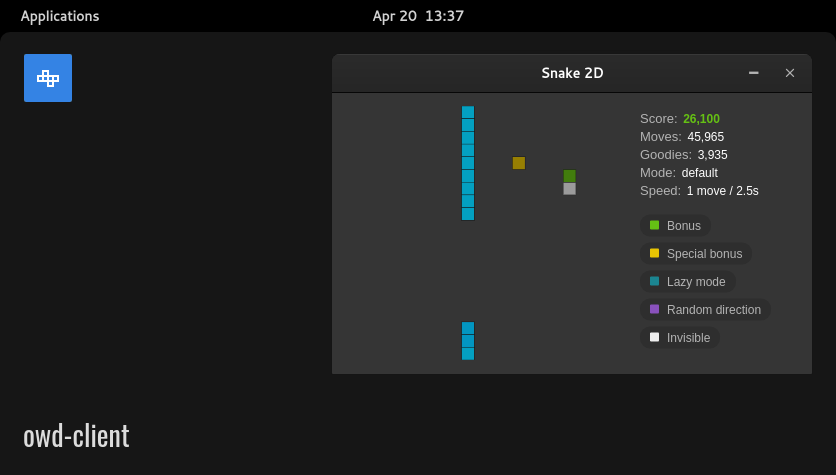

# Snake module for OWD Client
> 2D snake client of Web Plays Snake for Open Web Desktop

<p>
    
</p>

<p>
    <a href="LICENSE"></a>
    <a href="https://github.com/owdproject/owd-client"></a>
    <a href="https://github.com/topics/owd-modules"></a>
    <a href="https://hacklover.net/patreon"></a>
    <a href="https://hacklover.net/discord"></a>
</p>

## Demo
[Try it out](https://hacklover.net/client), just open the terminal and type "snake"

## Features
- A 2D client for [Web Plays Snake](https://snake.hacklover.net) that connects through the Server-Sent Events API
- Play from the terminal, send "snake" for available commands (requires [owd-terminal](https://github.com/hacklover/owd-terminal))

## Quick install
- Move to your client folder, then
  ```
  # Install this module with Npm
  npm install https://github.com/hacklover/owd-app-snake
  
  # Or using Yarn
  yarn add https://github.com/hacklover/owd-app-snake
  ```
- Define this module in `owd-client/client.extensions.ts`
  ```js
  import AboutModule from "@owd-client/core/src/modules/app/about";
  import DebugModule from "@owd-client/core/src/modules/app/debug";
  import SnakeModule from "owd-app-snake/client";

  export default {
    app: {
      modules: [
        AboutModule,
        DebugModule,
        SnakeModule,
      ]
    },
    ...
  ```
- Add this to `owd-client/vite.config.ts`
  ```
  optimizeDeps: {
    include: ['p5']
  }
  ```
- Copy the content of the [client/config](https://github.com/hacklover/owd-app-snake/tree/master/client/config) folder into `owd-client/config`

## Dependencies
- p5

## Compatibility
- Open Web Desktop client v2.0.0-beta.1

## License
This project is released under the [MIT License](LICENSE)